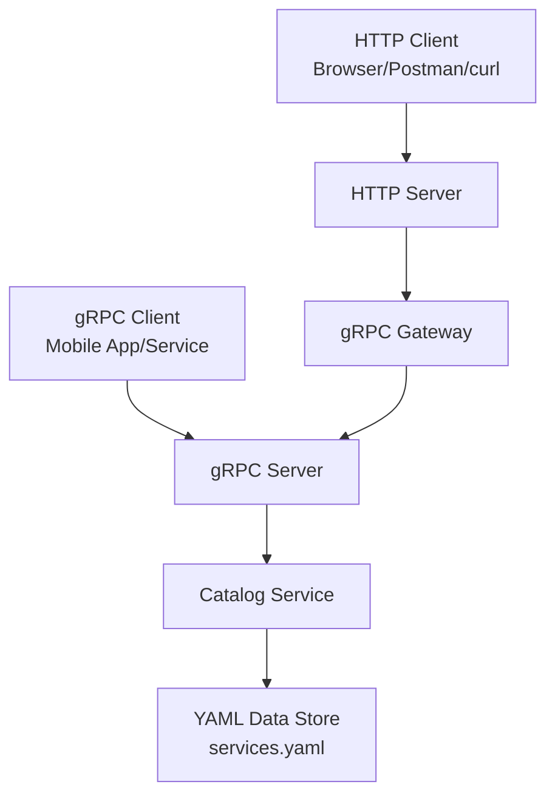

# Catalog Service

A Catalog service for managing service catalogs with gRPC and HTTP APIs, featuring JWT authentication and comprehensive testing.

Why GRPC is a good choice on the backend:
1. gRPC uses HTTP/2, which allows for multiplexing multiple requests over a single connection, reducing latency and improving throughput.
2. gRPC uses Protocol Buffers (protobuf) for defining service contracts, providing strong typing and backward compatibility.
3. gRPC supports bi-directional streaming, allowing for real-time data exchange between client and server.
4. gRPC supports multiple programming languages, making it easy to integrate with various systems and services.
5. gRPC automatically generates client and server code from protobuf definitions, reducing boilerplate code and improving development speed.

GRPC with http using grpc-gateway is a powerful combination that allows you to expose gRPC services over HTTP, 
enabling easy integration with web clients and RESTful APIs while retaining the performance benefits of gRPC.

A grpc-gateway is a reverse proxy that translates a RESTful HTTP API into gRPC, allowing clients to access gRPC services using standard HTTP requests.

### Prerequisites

#### For Local Development
- Go 1.24+
- Docker and Docker Compose
- Make for local development
- Buf for protobuf management using buf cli and buf generate
- buf uses protoc-gen-go, protoc-gen-go-grpc, and protoc-gen-grpc-gateway, validated to generate code for gRPC and HTTP APIs.

#### For Docker Build
The Dockerfile automatically installs and configures:
- buf (latest version)
- protoc (Protocol Buffers compiler)
- All required Go dependencies

No additional setup is required for Docker builds - everything is handled automatically.

## Architecture Diagram



### Local Development
1. Clone the repository:
   ```bash
   git clone <repository-url>
   cd catalog-service
   ```

2. Install dependencies:
   ```bash
   make deps
   ```

3. Generate protobuf files:
   ```bash
   make generate
   ```

4. Run the service locally if you have everything set up:
   ```bash
   make run
   ```

5. Or run with Docker Compose, I added all necessary libraries and services to the Dockerfile, so you can run the service with Docker Compose:
   ```bash
   make compose-up
   ```

### Testing

- Code Generation: `make generate`
- Run tests: `make test`
- Test API: `make test-api`
- Health check: `make health`
- Generate JWT token: `make jwt-token`

## API Endpoints

### Health Check
- `GET /health` - Service health status (no auth required)
```bash
curl -X GET "http://localhost:8000/health"
```

### Authentication
- `POST /auth/login` - Login to get JWT token
```bash
# Login with demo credentials
curl -X POST "http://localhost:8000/auth/login" \
  -H "Content-Type: application/json" \
  -d '{
    "email": "admin@org1.com",
    "password": "admin123",
    "organization": "org-1"
  }'

# Available demo users:
# - admin@org1.com / admin123 / org-1 (admin role)
# - user@org1.com / user123 / org-1 (user role)
# - admin@org2.com / admin123 / org-2 (admin role)
# - user@org2.com / user123 / org-2 (user role)
# - admin@org3.com / admin123 / org-3 (admin role)
# - user@org3.com / user123 / org-3 (user role)
```

### Services (require authentication)

#### List Services with Pagination, Sorting, and Filtering
- `GET /v1/services` - List all services

**Basic request:**
```bash
curl -X GET "http://localhost:8000/v1/services" \
  -H "Authorization: Bearer YOUR_JWT_TOKEN"
```

**With pagination:**
```bash
# First page with 5 items per page
curl -X GET "http://localhost:8000/v1/services?page_size=5" \
  -H "Authorization: Bearer YOUR_JWT_TOKEN"

# Next page using page token from previous response
curl -X GET "http://localhost:8000/v1/services?page_size=5&page_token=NEXT_PAGE_TOKEN" \
  -H "Authorization: Bearer YOUR_JWT_TOKEN"
```

**With filtering:**
```bash
# Filter by organization
curl -X GET "http://localhost:8000/v1/services?organization_id=org-1" \
  -H "Authorization: Bearer YOUR_JWT_TOKEN"

# Search in service names and descriptions
curl -X GET "http://localhost:8000/v1/services?search_query=user" \
  -H "Authorization: Bearer YOUR_JWT_TOKEN"

# Combine filters
curl -X GET "http://localhost:8000/v1/services?organization_id=org-1&search_query=service" \
  -H "Authorization: Bearer YOUR_JWT_TOKEN"
```

**With sorting:**
```bash
# Sort by name ascending
curl -X GET "http://localhost:8000/v1/services?sort_by=name&sort_order=asc" \
  -H "Authorization: Bearer YOUR_JWT_TOKEN"

# Sort by creation date descending
curl -X GET "http://localhost:8000/v1/services?sort_by=created_at&sort_order=desc" \
  -H "Authorization: Bearer YOUR_JWT_TOKEN"

# Sort by update date ascending
curl -X GET "http://localhost:8000/v1/services?sort_by=updated_at&sort_order=asc" \
  -H "Authorization: Bearer YOUR_JWT_TOKEN"
```

**Complete example with all parameters:**
```bash
curl -X GET "http://localhost:8000/v1/services?page_size=10&page_token=abc&organization_id=org-1&search_query=service&sort_by=name&sort_order=asc" \
  -H "Authorization: Bearer YOUR_JWT_TOKEN"
```

#### Get Specific Service
- `GET /v1/services/{id}` - Get specific service details
```bash
curl -X GET "http://localhost:8000/v1/services/svc-1" \
  -H "Authorization: Bearer YOUR_JWT_TOKEN"
```

#### Get Service Versions
- `GET /v1/services/{id}/versions` - Get service versions
```bash
curl -X GET "http://localhost:8000/v1/services/svc-1/versions" \
  -H "Authorization: Bearer YOUR_JWT_TOKEN"
```

### Query Parameters Reference

**Pagination:**
- `page_size` - Number of items per page (1-100, default: 10)
- `page_token` - Token for pagination (obtained from previous response)

**Filtering:**
- `organization_id` - Filter by organization ID
- `search_query` - Search in service names and descriptions

**Sorting:**
- `sort_by` - Sort field (allowed values: "name", "created_at", "updated_at")
- `sort_order` - Sort direction (allowed values: "asc", "desc")

## Swagger Documentation
- Run `make swagger` to generate Swagger documentation using redoc.
- Swagger UI is available at `http://localhost:8000/swagger` after running the service.


## Docker

### Build Image
```bash
make docker-build
```

### Run Container
```bash
make docker-run
```

### Docker Compose
```bash
# Start services
make compose-up

# Stop services
make compose-down
```
